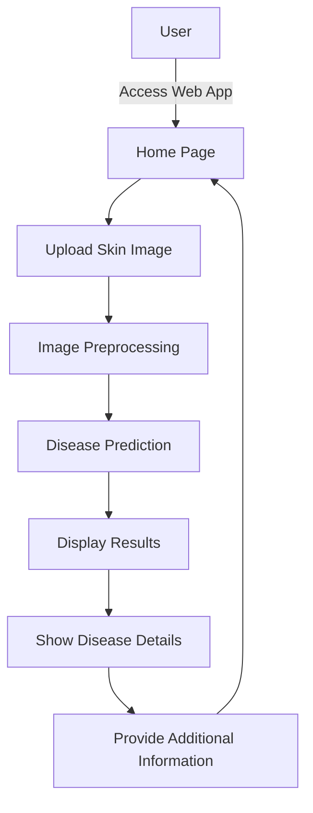

# Tvaksh - Skin Disease Detection System

Tvaksh is a web-based application that uses deep learning to detect and classify skin diseases from images. The application is built using Flask for the backend and provides a user-friendly interface for uploading and analyzing skin images.

## Features

- **Image Upload**: Users can upload skin images for analysis
- **Disease Detection**: Deep learning model to identify various skin conditions
- **Detailed Information**: Provides additional details about detected diseases
- **User-Friendly Interface**: Clean and intuitive web interface
- **Responsive Design**: Works on both desktop and mobile devices

## Project Structure

```
Tvaksh-master/
├── .gitattributes
├── app.py                # Main Flask application
├── config.json           # Configuration settings
├── disease_extra_details.csv  # Additional disease information
├── diseaseinfo.pkl       # Serialized disease information
├── labels.csv            # Dataset labels
├── saved_models/         # Trained model files
├── static/               # Static files (CSS, JS, images)
│   ├── css/
│   ├── img/
│   └── js/
├── templates/            # HTML templates
│   ├── about.html
│   ├── contactus.html
│   ├── display.html
│   ├── home.html
│   ├── index.html
│   ├── register.html
│   └── skinhealth.html
├── test_cases/           # Sample test images
└── user_uploads/         # Directory for user-uploaded images
```

## Flow Diagram



## Setup Instructions

1. **Prerequisites**
   - Python 3.6+
   - pip (Python package manager)

2. **Install Dependencies**
   ```bash
   pip install -r requirements.txt
   ```

3. **Run the Application**
   ```bash
   python app.py
   ```

4. **Access the Application**
   Open a web browser and navigate to `http://localhost:5000`

## Usage

1. Navigate to the application URL
2. Click on "Upload Image" to select a skin image
3. Wait for the analysis to complete
4. View the predicted disease and additional information
5. Explore additional features like skin health tips and contact options

## Technologies Used

- **Backend**: Python, Flask
- **Machine Learning**: Keras, scikit-learn
- **Frontend**: HTML, CSS, JavaScript
- **Data Processing**: Pandas, OpenCV

## License

This project is licensed under the [MIT License](LICENSE).

## Contact

For any queries or support, please contact the development team.
